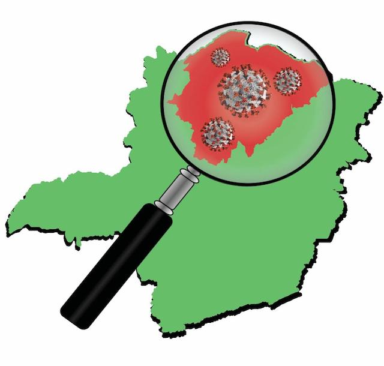

# KD-Covid

Project to organize COVID-19 tests in northern Minas Gerais, Brazil.

Conif Research Project No. 01/2020 - Confronting COVID-19: <b>"Detect to Confront: Monitoring and Diagnosis of Oligosymptomatic COVID-19 Cases through Digital, Geospatial and Molecular Tools"</b>

<h1 align="center">
    
</h1>

 

## 🧪 Technologies

This project was developed using the following technologies:

- [Android Studio](https://developer.android.com/studio)
- [Java](https://www.oracle.com/br/java/technologies/javase-downloads.html)
- [PHP](https://www.php.net/)

---
